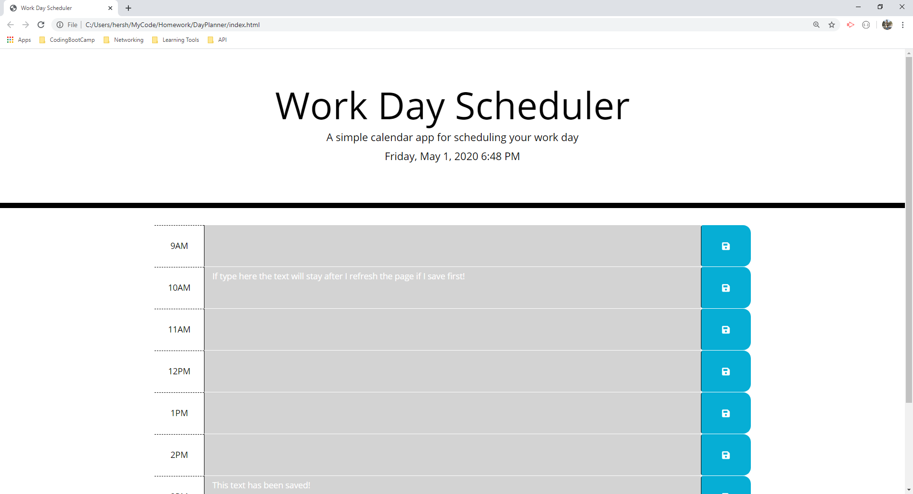
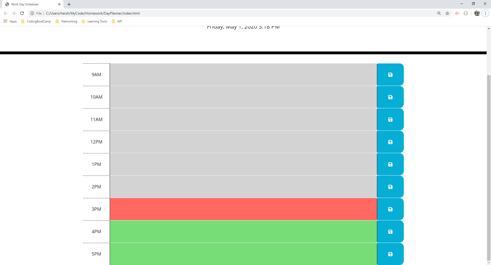
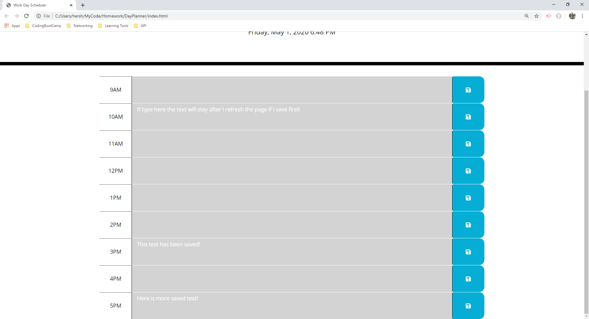

# DayPlanner
In this project I have created a day planner. The planner has a time and date that update automatically without the need to refresh the page. The planner is color coded to signify the current time of day. Any time slot that has passed will turn gray, the current time is colored red, and any future time is colored green. Text can be entered into each time slot and can be saved by pressing the button at the end of each time slot row. When the save button is pressed the text is saved to local storage and will be displayed when the page loads.

